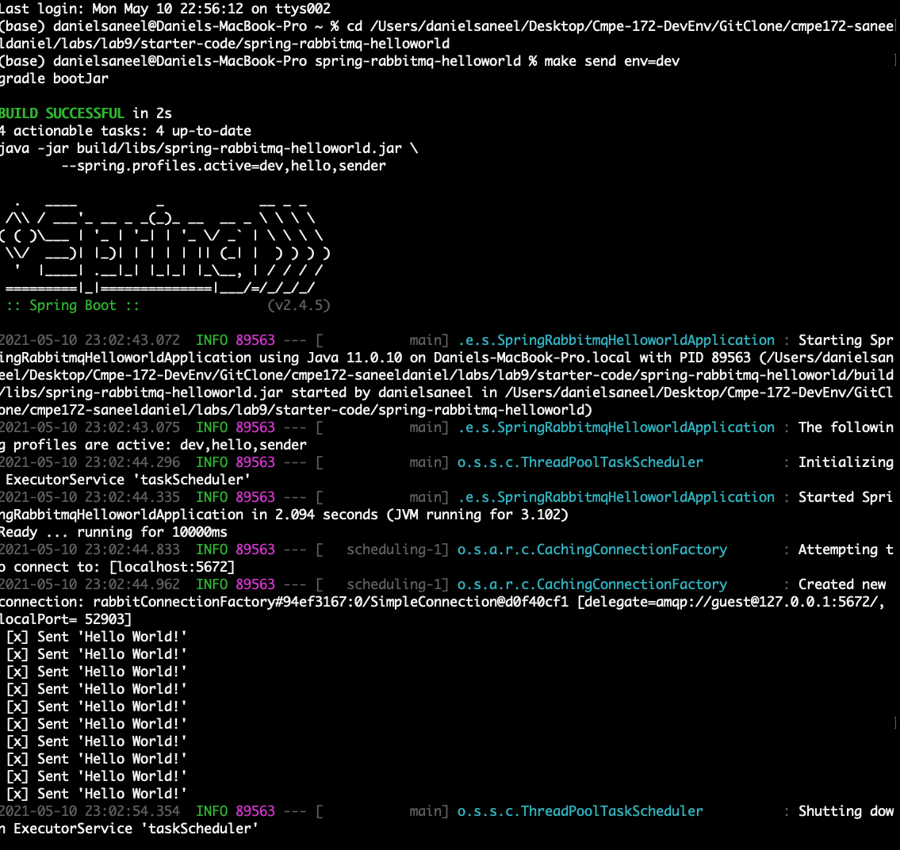
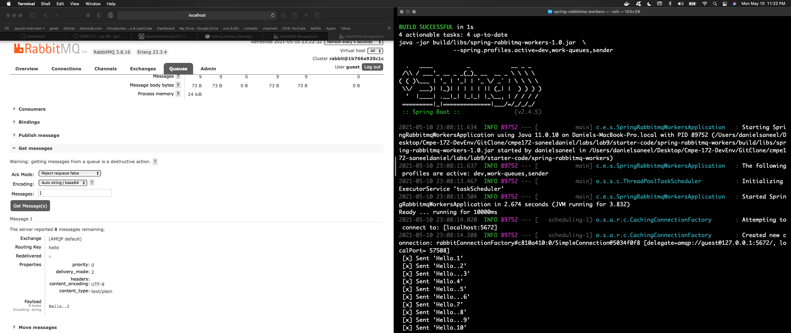

# Java-Spring RabbitMQ

In this 3 part Lab, I experimented with Spring AMQP Messaging using RabbitMQ, and have covered steps for its deployment to a local docker container, and interacked with the Workers feature to create several queues.

## Messaging with RabbitMQ -  Basic Intro to RabbitMQ with Spring

### Created a RabbitMQ Message Receiver with Spring

### Registered the Listener and Send a Message

### Sent a Test Message

### Configured Application Properties

### Screenshots of Running the Application

## RabbitMQ Tutorial - Hello World - Testing the Messaging feature with Rabbit Console

### Setup Spring Profiles

### Configured the project

### Screenshots for Running the app

- Sending

- Receiving

- Rabbit Console

## RabbitMQ Tutorial - Work Queues - Configuring Queues, and Managing frequency.

### Spring Profiles

### Configuring the project

### Running the app

- Sending

- Receiving

- Rabbit Console

# Lab Notes Discussion:

- Rabbit Queues can be used in projects, to control the data / transaction flow from the client to the server and vice versa, for enhanced ordered processing.

- Spring Framework makes configuration and wiring of Rabbit Qeues trivial, and takes apart a lot of complexity with the Dependency Injections, and pre-built template configurations. 

- This middle layer, can provide efficient and synchronous processing of app transactions. 

# References: 

Spring Guides - https://spring.io/guides/gs/messaging-rabbitmq/

Baeldung.com - https://www.baeldung.com/spring-amqp

## Instructions on how to run the app, 

### Please review the make file for commands:

### Basic Steps: 

-> Build (Gradle), Run (Gradle / BootRun) 

-> Docker : Build (Gradle), Build (Docker Image), Create Docker Network Bridge for RabbitMQ, Run (Docker Image)

